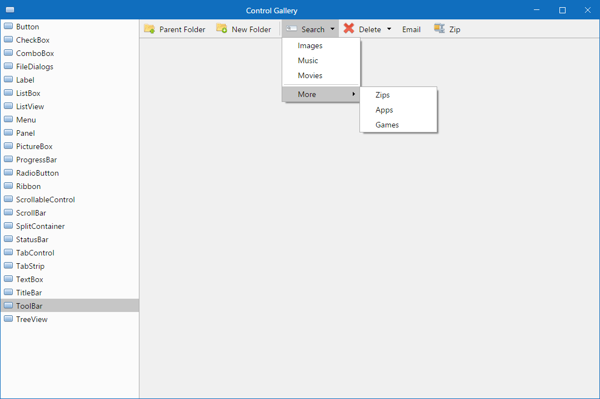

# ModernFormsNext

[](https://github.com/ProGraMajster/ModernFormsNext/actions/workflows/dotnet.yml)
[](https://www.nuget.org/packages/ModernFormsNext)
[](license.md)

ModernFormsNext is a code-first C# UI framework for .NET 10. It provides a familiar, desktop-style
programming model while owning its control tree, layout, input, styling, and SkiaSharp rendering.



> [!NOTE]
> ModernFormsNext is under active development. Windows is the primary and most mature platform;
> APIs and designer workflows continue to evolve.

## What is ModernFormsNext?

ModernFormsNext is inspired by WinForms and [Modern.Forms](https://github.com/modern-forms/Modern.Forms),
but it is not a skin over native WinForms controls. Framework controls are lightweight C# objects
rendered through the ModernFormsNext pipeline, primarily with SkiaSharp.

It is also not .NET MAUI, WPF, WinUI, Avalonia, Uno, Blazor, Electron, or a XAML framework.
ModernFormsNext uses code-first UI and keeps platform-neutral control logic separate from WindowKit
backends. The project is developing toward broader platform support, but it should not currently be
presented as a finished replacement for WinForms, MAUI, or other established UI frameworks.

## Current status

| Platform | Status | Target | Notes |
| --- | --- | --- | --- |
| Windows | Supported | `net10.0-windows` | Primary development, runtime, designer, and validation platform. |
| Android | **Experimental** | `net10.0-android` | Shared-control Skia surface and samples are available; full windowing and service parity are not. |

The repository does not currently provide supported macOS or Linux application backends.

### Android status

> [!WARNING]
> Android support in ModernFormsNext 1.9.0 is **Experimental**. APIs, project structure, and
> runtime behavior may still change. It is not yet recommended for production applications.

The Android backend can host one real ModernFormsNext control tree in an `AndroidSkiaHostView`.
The repository verifies shared layout and SkiaSharp rendering, logical-pixel density conversion,
multi-touch routing, scrolling, basic focus, hardware editing keys, Android IME text input,
lifecycle tracking, main-thread dispatching, and manifest-aware permissions.

Android does not yet provide the general `Application.Run(Form)` path, a complete WindowKit
windowing implementation, multiple framework windows, complete accessibility, native dialogs,
clipboard, file pickers, drag and drop, or the full platform-service set. See
[Android platform status](docs/platforms/android.md) for the verified support matrix, requirements,
known limitations, and sample commands.

## Highlights

- Code-first controls and forms with no XAML.
- Custom SkiaSharp-based rendering, layout, hit testing, input, focus, and styling.
- WinForms-like controls and APIs, including data binding, dialogs, menus, text controls, lists,
  layout containers, and custom controls.
- Native ModernFormsNext Markdown viewing and editing through `MarkdownViewer`, `DocumentViewer`,
  and `MarkdownEditor`—not an embedded browser.
- Hierarchical dynamic resources at control, parent, window, and application scope, with live
  resource references to CLR properties.
- Validated application themes with semantic/custom tokens, inheritance, strict versioned JSON,
  atomic runtime switching, and optional transitions through the shared animation scheduler.
- Platform-neutral WindowKit contracts with a mature Windows backend and an experimental Android
  backend.
- A ModernFormsNext-native form designer, `.mfdesign` documents, deterministic `.Designer.cs`
  generation, conservative reverse parsing, and a Visual Studio extension.
- Project and Visual Studio item templates for a clean Windows starter application.
- Automated framework, designer, resource, Unicode, and Android backend tests plus focused manual
  samples.

## Installation

ModernFormsNext 1.9.0 requires .NET 10. The repository selects SDK `10.0.201` in `global.json` and
allows roll-forward to a later installed .NET 10 feature band.

For an existing Windows application:

```powershell
dotnet add package ModernFormsNext --version 1.9.0
```

Install the project template and create an application:

```powershell
dotnet new install ModernFormsNext.Templates::1.9.0
dotnet new mfn-app -n MyApp
cd MyApp
dotnet run
```

The package and template commands use the release version and become available after 1.9.0 is
published. For source builds or pre-release validation, clone the repository and use project
references instead. See [installation](docs/installation.md) for package, template, VSIX, and
Experimental Instance instructions.

## Minimal example

This is the current Windows startup model used by the repository's reference application:

```csharp
using System.Drawing;
using ModernFormsNext;

internal static class Program
{
    [STAThread]
    private static void Main()
    {
        Application.Run(new MainForm());
    }
}

public sealed class MainForm : Form
{
    public MainForm()
    {
        Text = "Hello ModernFormsNext";
        Size = new Size(800, 600);

        var button = new Button
        {
            Text = "Click me",
            Bounds = new Rectangle(24, 24, 120, 40)
        };

        button.Click += (_, _) => button.Text = "Clicked";
        Controls.Add(button);
    }
}
```

Android currently uses an explicit activity and shared-surface adapter rather than this
`Application.Run(Form)` entry point. Start from the
[cross-platform sample](samples/ModernFormsNext.CrossPlatform.Sample/README.md) when evaluating the
Android backend.

## Visual Studio Designer

The optional `ModernFormsNextDesigner.vsix` adds **View ModernFormsNext Designer** for designable
ModernFormsNext forms and a **ModernFormsNext Form** item template. Version 1.9.0 of the VSIX is the
matching extension for the 1.9.0 framework release.

A designable form uses three related files:

```text
MainForm.cs             # user-authored form code
MainForm.Designer.cs    # generated initialization code
MainForm.mfdesign       # designer document and source of truth
```

The designer remains code-first: it edits `.mfdesign` and generates C# rather than XAML. New
generated form code assigns `Size`, while reverse parsing continues to accept `ClientSize` from
older generated files. Designer coordinates remain logical at 100%, 125%, 150%, 175%, and 200%
display scaling; device conversion is applied at the input and SkiaSharp rendering boundaries.

Download the matching VSIX from the GitHub release assets when published, or build it locally from
`ModernFormsNext.VisualStudioExtension.Vsix`. The manifest supports amd64 Community, Professional,
and Enterprise Visual Studio installations from version 17.0 onward without changing the existing
extension identity. See [installation](docs/installation.md) and
[designer architecture](docs/designer-architecture.md).

## Templates

`ModernFormsNext.Templates` contains the `mfn-app` .NET project template. It creates a minimal
`net10.0-windows` application with `Program.cs`, a partial `MainForm`, generated designer code, and
the companion `.mfdesign` document.

The Visual Studio extension also ships a **ModernFormsNext Form** item template for adding another
form triplet to an existing project. The default application reference is
[`samples/ModernFormsNext.DemoApp`](samples/ModernFormsNext.DemoApp); control experiments belong in
ControlGallery rather than in the generated starter experience.

## Packages

The 1.9.0 release is composed of these intentionally published NuGet packages:

| Package | Purpose |
| --- | --- |
| [`ModernFormsNext`](https://www.nuget.org/packages/ModernFormsNext) | Controls, forms, layout, input, documents, and rendering. |
| [`ModernFormsNext.Templates`](https://www.nuget.org/packages/ModernFormsNext.Templates) | `dotnet new` project template. |
| [`ModernFormsNext.WindowKit`](https://www.nuget.org/packages/ModernFormsNext.WindowKit) | Platform-neutral windowing and service contracts. |
| [`ModernFormsNext.WindowKit.Backend`](https://www.nuget.org/packages/ModernFormsNext.WindowKit.Backend) | Shared backend infrastructure. |
| [`ModernFormsNext.WindowKit.Backend.Windows`](https://www.nuget.org/packages/ModernFormsNext.WindowKit.Backend.Windows) | Windows backend implementation. |
| [`ModernFormsNext.Designing`](https://www.nuget.org/packages/ModernFormsNext.Designing) | Neutral design document, metadata, serialization, and validation APIs. |
| [`ModernFormsNext.CodeGeneration`](https://www.nuget.org/packages/ModernFormsNext.CodeGeneration) | C# designer generation and conservative reverse parsing. |
| [`ModernFormsNext.Designer`](https://www.nuget.org/packages/ModernFormsNext.Designer) | Reusable Windows designer shell and services. |

The experimental Android backend project is currently source-built in this repository and is not
declared as a publishable NuGet package.

## Documentation

- [Getting started](docs/getting-started.md)
- [Installation and Visual Studio Designer](docs/installation.md)
- [Changelog](CHANGELOG.md)
- [ModernFormsNext 1.9.0 release notes](docs/1.9.0-release-notes.md)
- [Migration from 1.8.0 to 1.9.0](docs/migrations/1.8.0-to-1.9.0.md)
- [Android platform status](docs/platforms/android.md)
- [Designer architecture](docs/designer-architecture.md)
- [Dynamic resources](docs/dynamic-resources.md)
- [Themes](docs/themes.md) and [theme JSON schema](docs/theme-json-schema.md)
- [Paint and gradients](docs/paint-and-gradients.md)
- [UI animations and interaction effects](docs/animations.md)
- [Markdown viewing](docs/markdown.md) and [Markdown editing](docs/markdown-editor.md)
- [Data binding](docs/data-binding.md)
- [Styling](docs/styling.md)
- [Platform-specific architecture](docs/platform-specific-code.md) and
  [platform-specific features](docs/platform-specific-features.md)
- [Framework roadmap](docs/roadmap/ModernFormsNext-Framework-Roadmap.md)
- [Release process](RELEASING.md)

## Samples

| Sample | Role |
| --- | --- |
| [`ControlGallery`](samples/ControlGallery) | Main Windows visual and interaction gallery for controls, layout, rendering, input, and themes. |
| [`ModernFormsNext.DemoApp`](samples/ModernFormsNext.DemoApp) | Minimal reference for the generated Windows application. |
| [`ModernFormsNext.DesignerPlayground`](samples/ModernFormsNext.DesignerPlayground) | Standalone host for designer development and manual validation. |
| [`ModernFormsNext.CrossPlatform.Sample`](samples/ModernFormsNext.CrossPlatform.Sample) | Shared Windows/Android control-tree vertical slice. |
| [`ModernFormsNext.Android.SmokeTest`](samples/ModernFormsNext.Android.SmokeTest) | Android lifecycle, manifest, and permission technical host. |
| [`Explorer`](samples/Explorer) and [`Outlaw`](samples/Outlaw) | Broader application examples and manual checks. |

Run ControlGallery on Windows:

```powershell
dotnet run --project .\samples\ControlGallery\ControlGallery.csproj
```

## Build the repository

Use the `.slnx` solution; the repository does not rely on a `.sln` file.

```powershell
git clone https://github.com/ProGraMajster/ModernFormsNext.git
cd ModernFormsNext
dotnet restore .\ModernFormsNext.slnx
dotnet build .\ModernFormsNext.slnx --configuration Debug --no-restore /p:EnableWindowsTargeting=true
dotnet test .\ModernFormsNext.slnx --configuration Debug --no-restore
```

Android builds additionally require the .NET Android workload, Android SDK/JDK, and a device or AVD
for deployment. The full setup is documented in [Android platform status](docs/platforms/android.md).

## Roadmap and versioning

The [framework roadmap](docs/roadmap/ModernFormsNext-Framework-Roadmap.md) separates implemented
capabilities from future work. Items such as navigation, localization, advanced visualization, and
optional feature packages are roadmap work unless the current code and release notes say otherwise.

ModernFormsNext uses semantic versioning. NuGet packages use `X.Y.Z`; Git release tags use
`vX.Y.Z`. See [RELEASING.md](RELEASING.md) for package, assembly, VSIX, validation, and publication
rules, and [CHANGELOG.md](CHANGELOG.md) for user-facing changes.

## Contributing and reporting issues

Contributions should preserve the code-first architecture, custom rendering model, platform
boundaries, public API documentation, and focused test coverage. Use `ModernFormsNext.slnx`, keep
sample roles distinct, and validate Windows behavior before submitting a change. Android changes
must describe their tested capability rather than claim general platform parity.

Report bugs and feature requests in the
[ModernFormsNext issue tracker](https://github.com/ProGraMajster/ModernFormsNext/issues). Include a
minimal reproduction, target framework, OS/version, display scale or Android density, and relevant
logs when possible.

## License

ModernFormsNext is distributed under the [MIT License](license.md). Derived and third-party code is
documented in [third-party-licenses.md](third-party-licenses.md).
