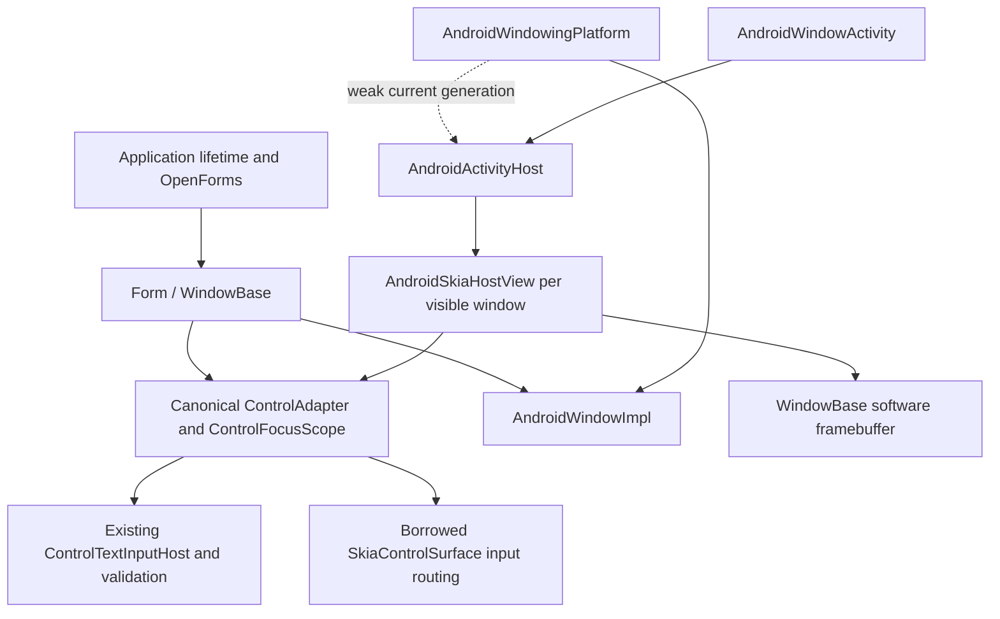

# Android Application and Form host

This is the experimental **source-tree** implementation for issue #72, not a package release.
Windows remains the primary platform. Android uses a real WindowKit window backend with a bounded
mobile policy: one main Form in one Activity, plus owned modal Forms and transient popups.

## Startup

Initialize the backend in the Android Application, before constructing Forms:

```csharp
public override void OnCreate()
{
    base.OnCreate();
    AndroidWindowKit.Initialize(new AndroidWindowKitOptions(this));
}

public sealed class MainActivity : AndroidWindowActivity
{
    protected override void OnStartApplication()
        => ModernFormsNext.Application.Run(new MainForm());
}
```

The Activity still needs its normal manifest/Activity attribute. Set
`android:enableOnBackInvokedCallback="true"` in the application manifest for modern Back.
The repository's cross-platform sample contains the complete Application, Activity, manifest and
shared MainForm. Custom Activities can own `AndroidActivityHost` and forward the lifecycle methods
documented on that class. Neither application constructs a Skia view, input adapter or focus tree.
The standalone Android smoke sample intentionally remains a technical permissions/lifecycle host.

`Application.Run` is called once, on the main thread, after host attachment. The optional
`IExternallyOwnedDispatcherImpl` capability distinguishes a native external loop from an
unsupported loop. Android registers its existing main-thread Handler as the WindowKit dispatcher.
Run installs persistent lifetime subscriptions, delivers startup, shows the Form, and **returns**.
Do not wrap the Form in a `using` whose scope ends immediately after Run. Dispose application-owned
Forms and controls on the UI thread when their application lifetime ends.

No nested Looper, worker UI thread, Android-only application loop or synchronous modal loop is
created. Posts, timers, InvokeAsync and cancellation use the existing dispatcher queue and native
Handler. Framework exit closes windows and finishes the Activity without quitting the main Looper.
Run cannot restart after framework exit in the same process; create a fresh application process.

## Ownership and routing



The process registry owns framework window contracts and a weak host reference. The Activity owns
its FrameLayout, presentations, native Views and software bitmaps. The input-only borrowed
SkiaControlSurface references the Form's exact ControlAdapter, text host and command resolver;
it does not create a synthetic root or reparent controls. The original public windowless surface
API remains available.

Generation and presentation epochs retire stale callbacks before replacement. Detach cancels
touch and held keys, revokes old IME sessions, releases native resources and dismisses popups.
The same Form, controls, selected control, document text and modal task survive Activity recreation.
Native focus must be confirmed again before a replacement IME session becomes active. Activity
pause is not Form.Hide, Close, or application exit. A destroyed host is detached, including
non-configuration destruction; it is not silently translated to user closure. Without a replacement
the framework remains in NoHost until explicit exit or a later Activity attachment.

Application lifetime modes retain their shared meanings: MainWindowClosed exits on designated-root
closure; LastWindowClosed exits when the final Form closes; Explicit requires Application.Exit.
OpenForms follows framework visibility/closure; native detach does not duplicate or remove entries.
Load and Shown remain once per Form. Repeated Show on a visible Form preserves its native View and
input epoch. Hide/Show keeps the main Form reusable; Hide clears canonical control selection,
so select the desired control again after showing. Hiding an owner dismisses
reusable popups and terminally closes modal descendants so no invisible modal can keep an owner
disabled. Closing an owner force-closes all descendants and completes modal tasks even if a cleanup
observer fails. A newer Show from a descendant's Closed observer supersedes the older owner Hide.
Modal/popup stacking, Back and recreation follow presentation order, not construction order.
Exceptions propagate after independent owned resources have been cleaned.

## Capability matrix

| Operation | Android behavior |
| --- | --- |
| Show / Hide / Close | Real native presentation; hide detaches View; close is terminal |
| Activate / Deactivate | Native Activity focus + resumed state + actual View focus; no fabricated activation |
| Main Form | One per Activity host; fills confirmed native content area |
| Additional top-level Form / concurrent Activity host | PlatformNotSupportedException |
| ShowDialog(owner) | Shared asynchronous modal task; centered bounded in-Activity surface; owner disabled |
| PopupWindow | Owned in-Activity surface, clamped to host; reusable Hide, dismiss on outside owner tap/Back/detach |
| Popup positioning | Shared top-left anchor/bottom-right gravity; unsupported combinations reject |
| Back | API 33+ OnBackInvokedDispatcher; older OnBackPressed fallback; after native IME handling, popup then modal then cancellable main Closing |
| Size / ClientSize | Main size is host controlled; size setter is a hint for modal/popup; getters change on native layout |
| Location / Move | Native physical screen origin readable; arbitrary top-level movement rejects |
| WindowState | Normal only; minimize/maximize reject |
| StartPosition / chrome | Host owns placement; no managed desktop title bar, border or drag behavior |
| Decorations / transparency hints | Host chrome wins; no transparency or extended-decoration capability advertised |
| Min/max constraints / CanResize | Nondefault desktop constraints and application-controlled resizability reject |
| Topmost / taskbar / per-Form icon | Unsupported operations reject; defaults remain usable |
| Screen | One current Activity display snapshot; no monitor enumeration or multi-display policy |
| Handle | Borrowed JNI View handle with descriptor AndroidView; zero when detached; never an HWND |
| Cursor | Non-null custom cursor rejects |
| IME and accessibility | Existing editor sessions and canonical semantic objects; no native EditText or second semantic tree |
| Render | Existing WindowBase software framebuffer into SKCanvasView; no GPU backend |

All window mutations require the UI thread. Unsupported setters reject before publishing managed
state where the facade stores a corresponding value. System decoration and transparency *hints*
do not promise desktop behavior. Popup shadows are a hint with no native shadow guarantee.
The existing `Form.BeginMoveDrag()` chrome helper deliberately does nothing for host-managed
windows, just as it does for embedded chrome; it never changes geometry. Direct backend desktop
move/resize-drag requests reject. This is the adapted chrome-helper policy, not drag support.

## Coordinates, safe area and input

Native layout confirms logical size, physical screen origin and density. Rendering uses the
existing device-scaled WindowBase pipeline; the software bitmap is presented with one inverse
density conversion. Native logical touches convert once to that same device-space control route.
Safe-area insets reduce the shared client DisplayRectangle once. Already fitted native decor has
zero remaining safe-area overlap. IME insets remain informational; the sample scrolls its caret
and accounts for remaining overlap without adding keyboard height twice.

Screen accessibility bounds from real window controls are already physical screen pixels. The
Android provider handles them without the windowless-surface density/origin conversion. Native
virtual nodes still wrap the same canonical accessibility objects and notifications. The existing
Form client-area peer remains in canonical Parent chains but is omitted from native child lists,
matching the canonical child enumeration and the Automation contract.

Pointer IDs, cancellation and scroll gestures reuse shared input routing. Form preview, existing
Control/ancestor/Form/Application bindings, validation and composition guards remain canonical.
Unhandled hardware printable keys are not converted into characters by this backend: text comes
from the IME path. Native popup focus keeps its owner logically active for the shared popup input
lease. No automatic vendor-IME or physical keyboard parity is implied.

Surface invalidation remains demand driven. The existing Choreographer source supplies animation
ticks, with no polling render timer. Hidden, paused, detached and closed presentations do not paint.

## Diagnostics and validation

Read `AndroidWindowKit.Current.GetWindowingDiagnostics()` on the main thread. The immutable snapshot
includes backend activity, host generation/attachment, lifecycle state, per-window visibility,
focus, logical size, density/font diagnostic scale, insets, paint count and active pointer count,
plus supported/unsupported capability policies. It contains no Java peers, editor text or activation
payload. Counters are observations, not animation progress estimates.

The platform-neutral `AndroidWindowingContractTests` exercise real Forms over the same window
implementation. The explicit native runner is:

```powershell
adb shell am instrument -w com.programajster.modernformsnext.sample/com.programajster.modernformsnext.sample.WindowingValidationInstrumentation
```

See [the final review and validation](development/issue-72-final-review.md) and the linked
implementation-stage report for exact builds, tests and observed emulator/device results.
Historical release-matrix results do not qualify a changed host automatically.

## Remaining scope

- #79: complete Android platform services, including clipboard, pickers, notifications and media.
- #60: arbitrary native-view embedding/composition with shared controls.
- #46: a GPU renderer/swapchain; this implementation deliberately uses software Skia.
- Linux/macOS: still need their own native windowing, input, graphics and lifecycle backends;
  Android's external-loop policy does not supply those implementations.
- Production readiness, minimum-API runtime qualification, vendor IMEs, physical keyboards,
  broad TalkBack/device coverage and distribution signing remain separate qualification work.
