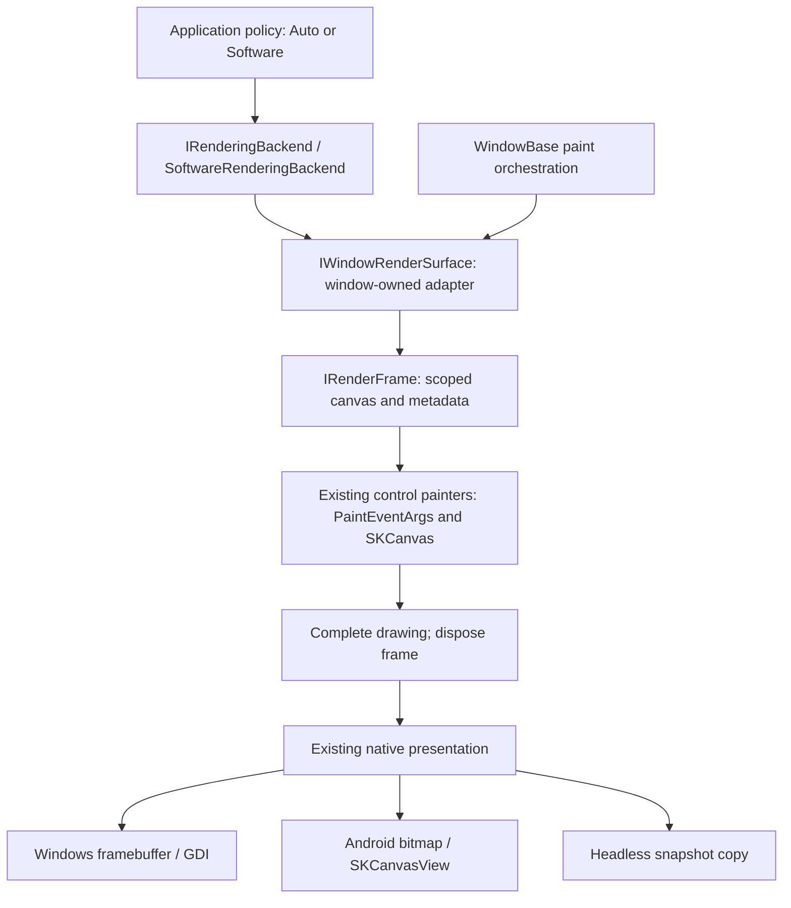

# Rendering backends: software foundation

Part of [#46](https://github.com/ProGraMajster/ModernFormsNext/issues/46), implemented under
[#170](https://github.com/ProGraMajster/ModernFormsNext/issues/170). This phase renders exclusively
on the CPU. It does not implement or probe a GPU backend.

## Configure once at startup

```csharp
using ModernFormsNext;

// Optional: omitting configuration is equivalent to Backend = RenderingBackend.Auto.
Application.ConfigureRendering(new RenderingOptions {
    Backend = RenderingBackend.Software
});
Application.Run(new MainForm());
```

Call before constructing a Form, calling Application.Run, or explicitly initializing a platform
backend. On Android, place configuration before Android backend initialization (for example at
the start of the application's OnCreate, before its existing bootstrap call), not in an Activity
that may be recreated. Existing application startup needs no changes.

Only these policies are available:

| Requested policy | Active renderer today | Meaning |
| --- | --- | --- |
| Auto (default) | Software | Select a supported renderer; a future version may select acceleration. |
| Software | Software | Require CPU raster rendering for diagnostics, CI and comparisons. |

Auto is never an active renderer. It selects Software directly, without probing unavailable APIs
or reporting a fictitious fallback. Hardware acceleration is not implemented in this phase.

RenderingOptions.Backend rejects undefined values with ArgumentOutOfRangeException.
ConfigureRendering rejects null. It copies the selected value: changing the supplied options
afterward cannot change either existing or future windows. Reconfiguration before initialization
replaces the copied choice. Reconfiguration after renderer initialization or a registered,
initialized platform backend throws InvalidOperationException, even if the value is unchanged.
The check also recognizes an installed IWindowingPlatform service when a public backend's Initialize
method was called directly without WindowKitBackendRegistry registration.
A failed platform startup after renderer resolution also leaves rendering frozen. Closing all
windows does not reset the application choice.

Configuration is startup-thread work; it must not race native bootstrap on another thread.
Reads of Application.RequestedRenderingBackend and Application.ActiveRenderingBackend are
thread-safe and do not initialize anything. ActiveRenderingBackend is null until resolution.
First Form creation resolves before the native window factory; the shared WindowBase constructor
also covers internal window factories and popups. Application.Run resolves when used with a custom
ICloseable root. Renderer policy has application lifetime; there is no per-window selection.

The supported TestHost borrows and restores rendering state with the existing application runtime
scope. Each new test runtime starts with Auto/uninitialized and remains software rendered. Host
cleanup disposes windows before restoring the caller's state. There is no public runtime-reset API.

ControlGallery accepts `--software` as the small executable configuration example; its default
remains Auto. The existing CrossPlatform sample backend status reports requested/active selection.

## Before and after

Before this extraction, WindowBase.DoPaint discovered IFramebufferPlatformSurface, called Lock,
mapped PixelFormat, built SKImageInfo and called SKSurface.Create with a native pointer and stride.
At the end of the callback, its using declarations disposed profiling, Skia and then the locked
framebuffer. Native presentation was already a separate responsibility.



The rendering contracts are internal to the framework, in ModernFormsNext.Rendering. They do not
expose a native window handle, GPU context, device, texture or swapchain. SKCanvas and SKImageInfo
are deliberate Skia-facing drawing contracts already used by PaintEventArgs. No control API changed.

- IRenderingBackend owns selection/diagnostic identity and creates window adapters. The resolver
  is Application.GetRenderingBackend; there is one instance per application runtime.
- IWindowRenderSurface belongs to WindowBase and borrows ITopLevelImpl. It acquires current
  presentation backing for a logical damage rectangle; it never owns or disposes the platform window.
- IRenderFrame leases the canvas, SKImageInfo, logical size, scale, damage and detached diagnostic
  metadata. ImageInfo dimensions are actual backing pixels, not recomputed logical dimensions.
- The Software implementation alone knows framebuffer address, row bytes, pixel-format mapping,
  memory-backed SKSurface construction and release order.

WindowBase keeps paint orchestration: window background, window border (temporary scale/save),
window OnPaint, content clip, adapter background, adapter paint, then optional diagnostics overlay.
The profiler's save/restore still removes the content clip before the window-wide HUD. Native
logical damage still becomes floor(left/top * scale), ceil(right/bottom * scale) device bounds.
Control renderers receive no selection enum and do not branch on renderer identity.

## Ownership, resize and failures

A window adapter is long-lived but holds no persistent framebuffer, bitmap, SKSurface or canvas.
Every AcquireFrame enumerates the current ITopLevelImpl.Surfaces and locks its current software
surface. This is essential: Android replaces presentations and TestHost exposes capture surfaces
only inside the capture callback. Resize and scale are read again with each acquisition; no second
window lifecycle or notification subscription is necessary.

The Software surface reuses internal resource holders in a small free list. Nested native paints
use distinct holders, preserving reentrancy. Each acquisition creates one small, separate lease;
its reference is permanently revoked before resource release. An old lease can never draw into or
dispose a later frame that reused the holder. Steady-state painting creates no new backend, resolver,
resource holder, collection or delegate. The allocation regression compares the complete acquisition
against the previous raster path without relaxing its threshold. SKSurface and ILockedFramebuffer
retain their previous per-paint lifetime. A borrowed canvas must never escape its using scope.

Complete seals successful drawing and prevents further canvas acquisition from that frame.
Software raster writes are already in the backing memory. Dispose retires Skia and then unlocks
the framebuffer, after inner profiler scopes have unwound. This retains the prior timing boundary.
On paint/overlay/acquisition failure, the same disposal path always releases any acquired lock.
If Skia disposal fails, framebuffer disposal still runs; platform exceptions are propagated.
The existing nested-finally policy can let a cleanup exception replace an earlier paint exception.

ILockedFramebuffer has no abort operation. Its disposal therefore preserves the existing platform
policy even after a paint exception: Windows may submit already-written partial pixels; Android
presents only if its enclosing native callback completes and its presentation is still current.
This phase does not invent transactional rollback, pixel copies or GPU-style fences.

Hide retains the managed adapter. Show, resize, DPI changes and Android recreation cause subsequent
acquisitions to observe the current surface. Close or managed Dispose retires the adapter and
prevents later acquisition. An already active frame is released by its own paint stack, not
prematurely by adapter disposal. Platform-owned backing must remain valid for the synchronous
paint callback under its existing ownership contract. No background rendering thread is introduced.
Surface acquisition and live frame reads/completion/disposal verify the creating thread. Completed
leases reject canvas and metadata access; disposed leases stay unusable even after another acquisition.

## Native presentation

### Windows

WindowImpl's existing surfaces expose FramebufferManager. WM_PAINT obtains a clipped BeginPaint
DC and damage rectangle. The manager locks its existing RAM backing and recreates it only when the
actual client pixel dimensions change. SoftwareRenderingBackend wraps that memory in Skia Raster.

LockedFramebuffer disposal calls DrawAndUnlock: StretchDIBits transfers the damaged top-down DIB
band during WM_PAINT; the existing SetDIBitsToDevice path applies outside that scope. The monitor
lock is released in finally. HWND creation, DIB allocation, DPI handling, popups and native invalidation
are unchanged. Native timing remains CPU GDI submission, not DWM display completion or GPU time.

### Android

AndroidWindowImpl exposes the active AndroidActivityHost.Presentation.Framebuffer. The presentation
resizes its software bitmap before calling WindowBase.Paint. The shared Software adapter renders
into it, then the existing AndroidSkiaHostView/SKCanvasView callback draws the bitmap to Android's
canvas using the existing density conversion.

The native Presentation.Current check still gates painting and submission on Activity ownership,
window visibility and PresentationEpoch. Recreation retires NativeSurfaces and attaches a new
presentation; the renderer resolves that new surface at the next acquisition. Insets, density,
popup/modal ownership, demand-driven invalidation, Choreographer, IME and accessibility stay in
their existing systems. Android already requests full native window paints; this refactor does
not claim to introduce partial Android presentation. The declared minimum remains API 23.

## Headless and offscreen raster policy

Headless Form and popup captures call the same WindowBase callback with a temporarily exposed
SnapshotFramebuffer. They therefore exercise the new Software adapter, including chrome, damage,
format, scaling and exception cleanup. The snapshot owns its detached byte copy, not a native lease.

Standalone offscreen bitmaps are intentionally simpler than presented windows:

- Control back buffers and clipped damage caches use SKBitmap/SKCanvas.
- Designer RuntimeControlPainter uses a bounded bitmap and existing control painting.
- Designer export and PrintDocument raster pages own their bitmap/canvas explicitly.
- PictureBox decoding/scaling and RenderedSnapshot PNG encoding remain bitmap operations.
- SkiaControlSurface draws into a caller-owned canvas; it owns neither that canvas nor presentation.

These paths do not need a fake window or another rendering API. They do not resolve a GPU backend.
Borrowed-canvas diagnostics remain unknown unless a real enclosing host supplies facts; the framework
does not infer GPU acceleration from an arbitrary SKCanvas.

## Diagnostics

The existing PerformanceProfiler remains the single recorder. PerformanceRenderInfo adds nullable
RequestedBackend and ActiveBackend plus FallbackReason. Software frames report Skia Raster,
Software acceleration, actual pixel dimensions/stride/backing bytes and damage coverage. Auto is
preserved as the request but never reported as active. FallbackReason is null because no fallback
occurred. Null requested/active metadata on other paths means unreported, not Auto.

The existing PlatformRenderInfo/native scope still supplies Windows/Android/Headless host identity,
host/backing generation and supported presentation CPU measurements. Merge preserves the renderer
identity when a later native presentation update arrives. Profiling-disabled paint does not build
diagnostic snapshots. No native handle or rendering object escapes through the records.

## Future boundaries and deliberate non-goals

The resolver is the future capability-selection insertion point. A later implementation can adapt
other objects from ITopLevelImpl.Surfaces while keeping controls and PaintEventArgs unchanged.
Internal interfaces may evolve when a real accelerated backend exposes concrete requirements;
this is not a public plugin registration or binary compatibility promise for external renderers.

Neither public configuration nor internal contracts mention Ganesh, Graphite or a native GPU API.
A Ganesh-to-Graphite implementation change should stay behind the frame/backend boundary, subject
to Skia continuing to provide the required SKCanvas painting API. Graphite integration is untested.

Native view composition (#60) stays with window/presentation ownership. A future Media implementation
can add internal resource-sharing contracts without leaking textures or native handles to controls.
Texture sharing, synchronization, composition ordering and zero-copy transport are not implemented
or guaranteed by this phase.

There is no Vulkan, OpenGL/GLES, ANGLE, D3D, Metal, swapchain, GPU discovery, new native dependency,
render thread, alternate control tree, driver fallback chain or package-version change here.
The first GPU PoC and explicit-GPU failure policy require a separate decision and validation.
