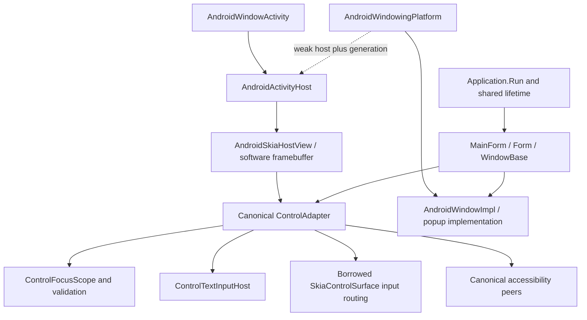

# Issue #72 final code and architecture review

Date: 2026-10-04. Base: `bcf2bcb1726cbb697d2e56600188c4ef2c91ebe1` (`master` at review).
Branch: `codex/issue-72-android-windowing`. This review covers the entire implementation diff,
including untracked source, tests, documentation and deletion of the transitional application host.
The [implementation-stage report](issue-72-android-windowing-report.md) preserves earlier evidence.
The accompanying PR records the commit identity and CI status; this document does not self-embed a
commit hash or claim a merge. Package versions, dependencies and required CI are unchanged.

## Findings and corrections

Three deterministic regressions failed before correction (`final-review/regressions-before.log`):

1. Repeated Show incremented the window epoch without replacing its existing View, silently retiring
   rendering/input callbacks. A visible Show now updates the existing presentation without changing
   its epoch. The native runner asserts View identity and a subsequent completed paint.
2. Back and Activity replacement used construction order for modal stacking. The single canonical
   window registry now records presentation order. A dialog constructed before its owner but shown
   afterward closes first. Contract coverage also checks replacement presentation order.
3. A modal Closed observer could reshow its owner while an older owner Hide unwound. The older Hide
   then destroyed the new display. Hide/retirement now check the captured epoch; native Present
   replaces only the obsolete View and guards reentrant cleanup. Text detach targets the exact
   obsolete native method, preserving newer ownership.

Lifecycle snapshot iteration also skips Views synchronously disposed by deactivation (for example
an open popup during Pause). Queued modern Back callbacks check the current host generation.
These guards address concrete reentrant lifecycle boundaries, without a second ownership system.
The native runner exercises backgrounding with a visible popup, new presentation rendering and IME
reacquisition, in addition to the original five-recreation and weak-reference collection checks.

The first expanded native test incorrectly expected Hide to preserve control selection. Shared
ControlFocusScope deliberately clears selection on Hide. The fixture now explicitly selects its
editor in the newer Show callback. No production focus semantics, timeout, retry or threshold was
changed to satisfy that assertion. Both the failed result and corrected runner result are retained.

WindowsAppHost now derives from the same MainForm used by Android, adding only desktop size and
diagnostics. This closes the sample acceptance gap without changing framework public signatures.
XML docs now describe presentation-scoped native handles and once-applied host safe area accurately.

## Architecture and behavior



- **Run/dispatcher:** an explicit neutral external-loop capability selects startup that returns
  after showing the Form. Lifetime subscriptions remain until Exit. Startup failure cleans up;
  a second Run in the same lifetime is rejected. Android posts/timers/InvokeAsync use the real main
  Handler. Exit retires the framework and finishes the Activity, without quitting the system Looper.
  Windows controlled-loop code and TestHost semantics remain unchanged.
- **Windows and relationships:** one main Form per Activity host, owner-bound asynchronous modal
  Forms and reusable popups. Independent top-level Forms/concurrent hosts reject without false
  visibility or leaked OpenForms entries. Owner Hide closes modal descendants and dismisses popups;
  owner Close force-cleans descendants. Modal completion reenables/activates its owner and completes
  the shared DialogResult task. No nested Looper is introduced.
- **Recreation/ownership:** the registry owns contracts and only a weak current native host. The
  Activity host owns its container, Views, provider attachments and bitmaps. Forms/controls remain
  application-owned. Generation/epoch checks revoke stale input, IME and Back callbacks. Recreation
  keeps the same tree, selected control and modal tasks, with fresh native presentation and focus
  confirmation. Hide releases presentation and clears selection; terminal Close cleans exactly once.
  No new finalizer performs UI cleanup.
- **Lifetime:** Hide/detach preserve OpenForms; recreation neither reloads nor duplicates Forms.
  PopupWindow is not a Form. MainWindowClosed, LastWindowClosed and Explicit retain their meanings.
  A destroyed host without a replacement is NoHost, not an invented close event. Framework Exit
  differs from process death; restarting that framework lifetime requires a fresh process.
- **Geometry:** top-level Move, non-Normal WindowState, topmost, taskbar/icon and nondefault min/max
  desktop constraints reject. Main size is host-controlled; modal/popup sizes are bounded hints.
  Native layout confirms geometry before callbacks. Screen is one current Activity display;
  AndroidView is a borrowed JNI handle valid only for the current presentation. Chrome hints use
  documented host policy; Form.BeginMoveDrag is the existing adapted chrome no-op.
- **Density/insets:** native logical input converts once into the existing device-space route.
  Painting and PointToScreen share DisplayRectangle's safe-area origin; the regression at density
  3 verifies `(45,81)` rather than `(15,21)`. Safe area is applied once; IME occlusion remains
  informational and caret scrolling is application policy. Font scale is distinct from density.
- **Back:** guarded API 33+ OnBackInvokedDispatcher; pre-33 OnBackPressed fallback. After native IME
  handling: popup, last shown modal, cancellable main closure. Instrumentation waits for the real
  IME transition/idle boundary and never retries a Back action.
- **Input:** native IDs/capture/cancel, keyboard preview/bindings, #160 canonical focus and #161
  validation use the existing router. Tests prove canceled validation preserves the current IME
  client; Form preview focus changes affect subsequent binding resolution, and Form KeyUp still
  observes shortcut-owned releases. One ControlTextInputHost lends revocable sessions to the existing
  Android InputConnection, without EditText or another text model.
- **Accessibility:** Android projects canonical parent ancestry around the omitted Form client-area
  layout peer. Shared semantics remain unchanged. Bounds from window peers are already screen pixels.
  Provider/session ownership follows the native presentation; retired IDs reject. Phase 3 waits for
  a real native focus event after one action; it adds neither action retries nor a longer timeout.
- **Rendering/diagnostics:** software WindowBase framebuffer presentation through existing Skia View
  and demand-driven invalidation/Choreographer. No GPU work or permanent render timer. Detached
  diagnostics contain state/capabilities/counters, no Activity/View references or text/activation data.

## Public API and visibility decisions

No existing framework public member was removed or renamed. These additions remain necessary:

| Type/member | Visibility and reason |
| --- | --- |
| IExternallyOwnedDispatcherImpl : IDispatcherImpl | Public `[PrivateApi]` cross-assembly backend marker; distinguishes an external loop from an absent loop |
| Dispatcher.HasExternalEventLoop | Public read-only capability; meaningful for other native-owned loops |
| IWindowHostPolicy.IsHostManaged | Public `[PrivateApi]` optional backend contract for host-owned placement/chrome |
| IWindowSurfaceInput.Pointer, Key, CancelInput, DismissPopup | Public `[PrivateApi]` transport between separate backend/core assemblies, without exposing Control or native types |
| WindowSurfacePointerAction.Down/Move/Up/Cancel | Public transport enum required by that interface; neutral pointer transitions |
| AndroidWindowActivity | Public abstract supported entry point; protected OnStartApplication is the application extension point |
| AndroidActivityHost | Public sealed alternative for custom Activity inheritance; constructor `(Activity, Bundle?)`, HasMainWindow, Start, Resume, Pause, Stop, ConfigurationChanged, WindowFocusChanged, HandleBack, Dispose |
| AndroidWindowKitBackend.GetWindowingDiagnostics() | Public detached diagnostic snapshot for applications/tooling |
| AndroidMainThreadDispatcher.CurrentThreadIsLoopThread, Now, Signal, UpdateTimer, Signaled, Timer | Public additions implementing IDispatcherImpl on the existing dispatcher |

AndroidWindowActivity's forwarding overrides are OnCreate, OnStart, OnResume, OnPause, OnStop,
OnWindowFocusChanged, OnConfigurationChanged, OnNewIntent, OnRequestPermissionsResult,
OnBackPressed and OnDestroy, with the visibility required by Activity. Its constructor is the
implicit protected default constructor. XML docs describe startup, thread affinity and ownership.

Public positional record constructors/properties (plus compiler-generated record equality,
copy/printing and deconstruction members):

- AndroidWindowingDiagnostics: Active, HostGeneration, Attached, ActivityState, Windows;
  additional read-only WindowPolicy, SupportedCapabilities, UnsupportedOperations.
- AndroidWindowDiagnostics: Main, Popup, Modal, Visible, Attached, Active, LogicalSize, Density,
  ScaledDensity, Insets, PaintCount, ActivePointers.

Sample-only public additions: MainForm(App), WindowingValidationInstrumentation (parameterless
and JNI constructors, OnCreate and OnStart overrides). MainForm is extensible solely so the Windows
sample can share it. No framework signature/visibility was changed during final review; the repo
does not configure a general ApiCompat task. Existing API compatibility regressions run in the full
suite; both sample target builds cover the sample-only base-class change.

New internal/platform contracts: AndroidWindowingPlatform; AndroidWindowImpl; AndroidPopupImpl;
AndroidWindowTextInput; AndroidScreenImpl; IAndroidWindowHost; native Presentation and Framebuffer;
ControlAdapter surface input/accessibility notification hooks and pointer-ownership delegates;
borrowed SkiaControlSurface(WindowBase); WindowBase preview/resolver hooks; AndroidSkiaHostView's
window-coordinate flag; AndroidAccessibilitySession.ProjectedParent; NativeValidationViews for
instrumentation. Generation/epoch state and text Detach(expected) stay internal.

The neutral contracts contain no Android types and prescribe neither a framebuffer format nor
native child composition, leaving #46 GPU and #60 native hosting separate. They can describe a
future native-owned platform loop without claiming any Linux/macOS/iOS implementation.

## Compatibility and scope audit

API minimum remains 23. New Back registration/unregistration and implementation are guarded and
annotated for API 33; Activity.IsDestroyed is available before 23. Display metrics/layout use
existing APIs. Existing insets distinguish guarded API 30 typed IME/system bars, API 28 cutouts,
and legacy stable edges. Existing accessibility/IME version guards are retained. Compilation is
not runtime qualification on API 23-32.

Source search finds normal native View construction only in the backend host; the sample no longer
constructs AndroidAppHost, SkiaControlSurface or AndroidSkiaHostView. AndroidAppHost.cs is deleted.
The technical smoke application remains a platform-service fixture. MainForm is shared on both
targets. Repository templates remain Windows templates; Android template guidance is the complete
Application/Activity/manifest/sample startup documented in android-windowing.md, without claiming
a new dotnet-new/Visual Studio Android template.

No new package references, AndroidX/MAUI dependency, native control tree, GPU implementation,
service placeholders, public API removal, package metadata/version change or CI weakening.
#60, #79, #46 and #168 remain separate OPEN issues. #63/#160/#161 are reused context only.

## Validation and acceptance

Final validation is recorded below after the review corrections. Evidence is retained under
ignored `artifacts/issue-72/final-review/`; earlier matrix evidence is historical and linked above.

| Final-tree check | Result |
| --- | --- |
| Restore; full sequential Debug and Release builds | PASS; each build 0 warnings / 0 errors |
| Full Release tests | 4097 passed, 0 failed, 0 skipped across 9 projects |
| Full Debug tests, first run | 4096 passed, 1 failed, 0 skipped: Windows native UIA calendar popup discovery |
| Full Debug confirmation run | 4096 passed, 1 failed, 0 skipped: brush allocation assertion, 552 B against 256 B |
| Isolated Windows UIA failure check | PASS; Windows backend then passed 328/328 in the Debug confirmation and Release suites |
| Android backend tests | 382/382 in every final full run, including 24 windowing cases |
| Windows native HWND start/CloseMainWindow | PASS, exit 0: ControlGallery, DemoApp, CrossPlatform.Sample |
| Debug standalone APK; Release APK | PASS, including actual native runs below |
| Release AAB, profiled Mono AOT / partial trim | PASS; API 23 minimum / target 36, arm64+x64, embedded assemblies; AOT libraries verified in APK and AAB |
| Changed Markdown link/document checks | PASS, 13 Markdown files |
| Source identity after validation | All non-document source hashes unchanged |

Full per-project counts: Automation 166; Automation.Windows 66; CrossPlatform.Sample 29;
Designer 691; Testing 927; framework core 1482; VSIX 26; Android backend 382; Windows backend 328.
Debug's failing project is respectively Windows backend (327/328) and core (1481/1482).
**Neither final Debug full run was wholly green.** Release is a single green full run. No test was
skipped, thresholds/timeouts were not changed, and no automatic retry was added.

The Windows UIA failure reported `Native calendar popup was not discoverable`; its exact cause was
not established. The brush test passed in the first Debug run and Release but observed 552 B in
the second Debug run. Its test and measured BrushAnimationPlan implementation have no diff in #72;
no deterministic #72 regression was established. This is **not** #168's profiler recording test:
the live issue explicitly distinguishes those two allocation tests. Both failures remain in the
evidence and must be considered at final merge review; this PR does not claim to resolve either.

| Automated native runner, both Debug and Release | Pixel_8 emulator, API 34, x86_64 | nubia NX769J physical phone, API 36, arm64 |
| --- | --- | --- |
| Windowing, expanded final runner | 61/61 PASS | 61/61 PASS |
| Accessibility Phase 4 | 65/65 PASS | 65/65 PASS |
| Accessibility Phase 3 | 49/49 PASS | 49/49 PASS |

These native results use real Views, main Looper, InputConnection, Back and Activity recreation.
Windowing includes five replacements, old session rejection, retired View/Activity GC, timer
cancellation, posts/InvokeAsync and a still-running system Looper after framework Exit. A physical
Debug attempt made while the phone was asleep/backgrounded failed at startup (0 assertions); after
the user unlocked it, the unchanged runner passed. That failed attempt is retained separately.

The earlier full native matrix (95 emulator / 105 phone assertions per configuration) and ten
consecutive physical Release Phase 3 runs belong to the implementation-stage report. They were
**not repeated as a complete matrix** after final review and are not presented as final-tree runs.
The final focused reruns cover the changed presentation, lifecycle, IME and accessibility paths.

Manual/qualification **NOT EXECUTED**: API 23-32 runtime; TalkBack speech/gestures; vendor IME
typing/composition; physical hardware keyboard; broad OEM coverage; Visual Studio F5 Android
workflow; manual Windows visual interaction; actual 90/120 Hz rendering qualification; Play Store
signing/submission. The earlier phone measurements were approximately 60 Hz despite advertised
60/90/120 modes. Native automation does not qualify these manual or distribution scenarios.
Windows template source was unchanged; DemoApp normal native startup/close was verified.

Commands (repository root; Debug/Release MSBuild and tests run sequentially):

```powershell
dotnet restore ModernFormsNext.slnx
dotnet build ModernFormsNext.slnx -c Debug --no-restore -m:1 /p:UseSharedCompilation=false /p:EnableWindowsTargeting=true
dotnet test ModernFormsNext.slnx -c Debug --no-build --no-restore -m:1 /p:UseSharedCompilation=false --logger trx --results-directory artifacts/issue-72/final-review/test-Debug
# One full confirmation after investigation of the native UIA failure, with separate logs/TRX.
dotnet build ModernFormsNext.slnx -c Release --no-restore -m:1 /p:UseSharedCompilation=false /p:EnableWindowsTargeting=true
dotnet test ModernFormsNext.slnx -c Release --no-build --no-restore -m:1 /p:UseSharedCompilation=false --logger trx --results-directory artifacts/issue-72/final-review/test-Release
dotnet build samples/ModernFormsNext.CrossPlatform.Sample/ModernFormsNext.CrossPlatform.Sample.csproj -c Debug -f net10.0-android -t:SignAndroidPackage -m:1 /p:UseSharedCompilation=false /p:EmbedAssembliesIntoApk=true /p:AndroidPackageFormats=apk
dotnet publish samples/ModernFormsNext.CrossPlatform.Sample/ModernFormsNext.CrossPlatform.Sample.csproj -c Release -f net10.0-android -m:1 /p:UseSharedCompilation=false /p:AndroidPackageFormats=aab
adb -s <serial> install --no-streaming -r <signed-apk>
adb -s <serial> shell am force-stop com.programajster.modernformsnext.sample
adb -s <serial> shell am instrument -w com.programajster.modernformsnext.sample/com.programajster.modernformsnext.sample.WindowingValidationInstrumentation
# Same invocation for AccessibilityPhase4Instrumentation and AccessibilityInstrumentation.
git -c core.safecrlf=false diff --check
```

Release APK is produced by the full Release solution build, copied before AAB packaging, then
installed for native tests. Packaging evidence includes effective AOT/trim/minimum-API properties
and APK/AAB library inspection. Logs, source hashes, APK/AAB and TRX remain ignored local evidence.

### Acceptance decision against the live issue

| # | Criterion | Status and evidence |
| --- | --- | --- |
| 1 | Supported Android startup aligned with Application semantics | PASS: real Application.Run(Form), explicit external-loop capability, lifetime/failure tests and native queue/exit checks |
| 2 | Required WindowKit backend contracts | PASS: registered window/dispatcher backend, real surface/framebuffer and popup contracts, no Windows implementation in Android/shared additions |
| 3 | Form, popup, modal, ownership and multi-window behavior | PASS: documented one-main policy, 24 contract cases and 61 native assertions, deterministic rejection of a second main |
| 4 | Lifecycle/recreation/insets/input/renderer integration | PASS: existing #63/#160/#161 infrastructure, native five-recreation/weak-reference and IME checks, single-safe-area regression |
| 5 | Capability differences and diagnostics | PASS: explicit unsupported desktop operations and detached payload-free snapshots; experimental status remains explicit |
| 6 | Templates/docs and representative emulator/physical validation | PASS: Android startup guidance and complete migrated shared sample, both target builds, API 34 emulator/API 36 physical automation; no new Android template/package or broad qualification claimed |

Use **Fixes #72** for this bounded implementation. The six criteria are met; absence of desktop
multi-main, #79 services, #60 native child hosting, #46 GPU and production-wide qualification is
explicitly outside the accepted mobile policy. This is not permission to merge, an unconditional
all-tests-green claim, or closure of related issues. The open PR remains subject to its required
`build` check and final review of the disclosed Debug failures.

## Exact commit inventory

56 paths: 38 modified, 17 added, 1 deleted. Relative to the implementation-stage 54-path
inventory, final review adds WindowsAppHost.cs and this report. The deleted path is the old
AndroidAppHost.cs. A/M/D below are relative to the reviewed base.

```text
M docs/android-accessibility.md
M docs/android-backend.md
A docs/android-windowing.md
M docs/application-lifecycle.md
M docs/architecture/android-animation-runtime.md
M docs/cross-platform-sample.md
A docs/development/issue-72-android-windowing-report.md
A docs/development/issue-72-final-review.md
M docs/known-limitations.md
M docs/platform-specific-code.md
M docs/platforms/android.md
M ModernFormsNext.CrossPlatform.Sample.Tests/AndroidToolingContractTests.cs
A ModernFormsNext.WindowKit.Backend.Android.Tests/AndroidWindowingContractTests.cs
M ModernFormsNext.WindowKit.Backend.Android/Accessibility/AndroidAccessibilitySession.cs
M ModernFormsNext.WindowKit.Backend.Android/Platform/Accessibility/AndroidAccessibilityNodeProvider.cs
M ModernFormsNext.WindowKit.Backend.Android/Platform/AndroidWindowKitBackend.cs
M ModernFormsNext.WindowKit.Backend.Android/Platform/Dispatching/AndroidMainThreadDispatcher.cs
M ModernFormsNext.WindowKit.Backend.Android/Platform/Rendering/AndroidSkiaHostView.cs
A ModernFormsNext.WindowKit.Backend.Android/Platform/Windowing/AndroidActivityHost.cs
A ModernFormsNext.WindowKit.Backend.Android/Platform/Windowing/AndroidWindowActivity.cs
A ModernFormsNext.WindowKit.Backend.Android/Windowing/AndroidWindowImpl.cs
A ModernFormsNext.WindowKit.Backend.Android/Windowing/AndroidWindowingDiagnostics.cs
A ModernFormsNext.WindowKit.Backend.Android/Windowing/AndroidWindowingPlatform.cs
A ModernFormsNext.WindowKit.Backend.Android/Windowing/AndroidWindowSupport.cs
M ModernFormsNext.WindowKit.Backend/Properties/AssemblyInfo.cs
M ModernFormsNext.WindowKit/Dispatcher.cs
A ModernFormsNext.WindowKit/ExternallyOwnedDispatcherImpl.cs
A ModernFormsNext.WindowKit/Platform/IWindowHostPolicy.cs
M ModernFormsNext/Application.cs
M ModernFormsNext/Application.Lifecycle.cs
M ModernFormsNext/Application.Testing.cs
M ModernFormsNext/Control.Accessibility.cs
M ModernFormsNext/Control.cs
M ModernFormsNext/ControlAdapter.cs
A ModernFormsNext/ControlAdapter.SurfaceInput.cs
M ModernFormsNext/Form.cs
M ModernFormsNext/SkiaControlSurface.cs
M ModernFormsNext/SkiaControlSurface.Keyboard.cs
M ModernFormsNext/WindowBase.cs
M ModernFormsNext/WindowBase.Lifecycle.cs
A ModernFormsNext/WindowBase.SurfaceInput.cs
M README.md
M samples/ModernFormsNext.CrossPlatform.Sample/App.cs
A samples/ModernFormsNext.CrossPlatform.Sample/MainForm.cs
M samples/ModernFormsNext.CrossPlatform.Sample/MainPage.cs
M samples/ModernFormsNext.CrossPlatform.Sample/Platforms/Android/AccessibilityInstrumentation.cs
M samples/ModernFormsNext.CrossPlatform.Sample/Platforms/Android/AccessibilityPhase4Instrumentation.cs
D samples/ModernFormsNext.CrossPlatform.Sample/Platforms/Android/AndroidAppHost.cs
M samples/ModernFormsNext.CrossPlatform.Sample/Platforms/Android/AndroidManifest.xml
M samples/ModernFormsNext.CrossPlatform.Sample/Platforms/Android/MainActivity.cs
A samples/ModernFormsNext.CrossPlatform.Sample/Platforms/Android/NativeValidationViews.cs
M samples/ModernFormsNext.CrossPlatform.Sample/Platforms/Android/ReleaseValidationInstrumentation.cs
M samples/ModernFormsNext.CrossPlatform.Sample/Platforms/Android/SampleApplication.cs
A samples/ModernFormsNext.CrossPlatform.Sample/Platforms/Android/WindowingValidationInstrumentation.cs
M samples/ModernFormsNext.CrossPlatform.Sample/Platforms/Windows/WindowsAppHost.cs
M samples/ModernFormsNext.CrossPlatform.Sample/README.md
```
