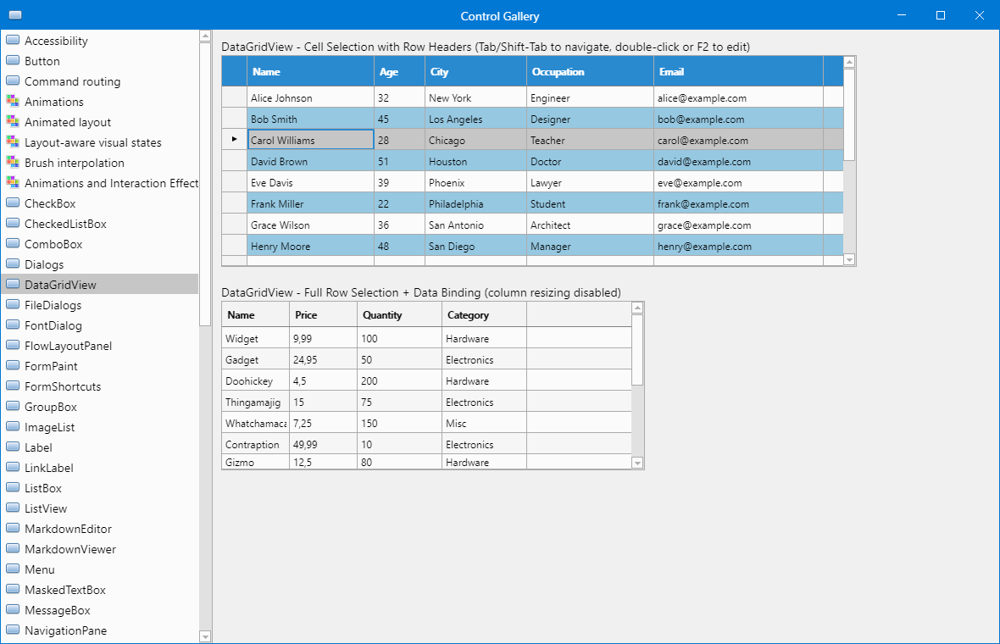
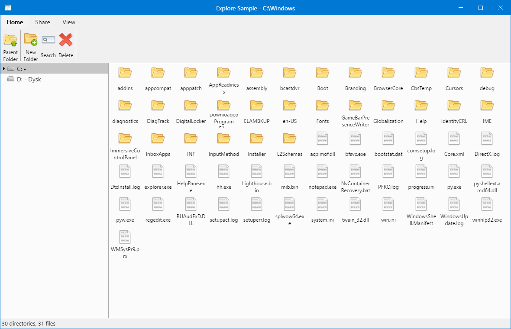
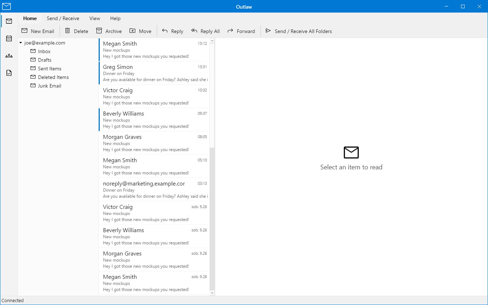

# Samples

[Documentation index](README.md)

Use **ControlGallery** to explore controls and **ModernFormsNext.DemoApp** to learn the recommended
starter structure. Explorer and Outlaw demonstrate larger desktop layouts. Windows is the primary
runtime target; the shared Windows/Android sample has a separate, experimental Android host.

Run the commands below from the repository root with the SDK selected by `global.json`.

| Application | Purpose |
| --- | --- |
| ControlGallery | Controls, layout, rendering, themes, input, and visual regression checks. |
| Explorer | File browsing, ribbon groups, tree navigation, and icon lists. |
| Outlaw | Mail-style navigation, toolbars, and an owner-drawn message list with sample data. |
| ModernFormsNext.DemoApp | Minimal template/reference application. |
| ModernFormsNext.DesignerPlayground | Standalone Designer development and manual checks. |
| ModernFormsNext.CrossPlatform.Sample | One shared control tree hosted on Windows and Android. |
| ModernFormsNext.Android.SmokeTest | Technical Android lifecycle, manifest, and permission checks. |

## ControlGallery

The main visual gallery covers buttons, inputs, checked and selectable lists, rich text, Markdown,
menus, tooltips, containers, and layout elements. The screenshot shows the **DataGridView** page
with cell selection, row headers, and a second data-bound grid.



```powershell
dotnet run --project .\samples\ControlGallery\ControlGallery.csproj
```

The **Animations and Interaction Effects** page demonstrates pointer- and center-origin ripple,
rapid bounded waves, press scale, hover/focus/disabled transitions, sequence, parallel, timeline,
keyframes, repeat, auto-reverse, custom definitions and interpolators, cancellation, replacement
policies, reduced motion, animations disabled, and scheduler/ripple diagnostics. It is opt-in and
restores the animation policy when unloaded.

The **MarkdownEditor** page demonstrates Editor, Preview, and Split modes, the public command
toolbar, Ctrl+K, hosted link and image request dialogs built only from ModernFormsNext controls,
preview link forwarding, and optional proportional scroll synchronization. Its source includes
editable links and images, Unicode, local and HTTP image sources, and enough content for manual
scroll testing. The hosted image dialog can insert a reference unchanged or choose a local raster
image with the ModernFormsNext file picker and copy it into `MarkdownEditorAssets` beside the
sample output. Collision handling is selectable; no source-repository directory is modified.
The editor also demonstrates list-aware Enter/Tab/Backspace, AltGr-safe shortcuts, and undo/redo.

## Explorer

Explorer demonstrates ribbon groups, theme choices, a directory tree, and a file list. The
screenshot shows the Windows system directory. Directory navigation is implemented; several
ribbon actions deliberately show a "Functionality not available in demo" message.



```powershell
dotnet run --project .\samples\Explorer\Explore.csproj
```

The directory is named `Explorer`, while the project file is `Explore.csproj`.

## Outlaw

Outlaw demonstrates a mail-style layout with navigation, tabbed toolbars, an owner-drawn message
list, and a placeholder reading pane. The messages are generated sample data; this is a UI example,
not a connected mail client.



```powershell
dotnet run --project .\samples\Outlaw\Outlaw.csproj
```

## Template and Designer hosts

### ModernFormsNext.DemoApp

The template/reference application validates that the default generated application stays clean,
minimal, beginner-friendly, and aligned with `ModernFormsNext.Templates`. Control experiments and
visual regressions belong in ControlGallery.

```powershell
dotnet run --project .\samples\ModernFormsNext.DemoApp\ModernFormsNext.DemoApp.csproj
```

See [getting started](getting-started.md) and [installation](installation.md).

### ModernFormsNext.DesignerPlayground

The standalone host is for Designer development and manual validation. Running it does not replace
verification of the Visual Studio extension and its out-of-process host.

```powershell
dotnet run --project .\samples\ModernFormsNext.DesignerPlayground\ModernFormsNext.DesignerPlayground.csproj
```

See [Designer architecture](designer-architecture.md) and
[Visual Studio host](visual-studio-designer-host.md).

## Android and shared hosts

### ModernFormsNext.CrossPlatform.Sample

A multi-target project organized around shared `App` and `MainPage` files plus thin
`Platforms/Windows` and `Platforms/Android` hosts. Both targets use the same real ModernFormsNext
control tree. Android reaches that tree through the transitional `SkiaControlSurface` rather than
a complete Android `IWindowingPlatform`.

```powershell
.\scripts\windows\Run-CrossPlatformSample.ps1
.\scripts\android\Run-CrossPlatformSample.ps1 -DeviceId <serial>
```

See the [cross-platform sample guide](cross-platform-sample.md) and
[Android support matrix](platforms/android.md) for prerequisites and current limitations.

### ModernFormsNext.Android.SmokeTest

This technical host exercises Android lifecycle, manifests, permissions, and backend integration.
Use the [Android development guide](android-development.md) for setup and the
[release validation matrix](android-release-validation.md) for the scope of device evidence.

## Screenshot provenance

The Windows images above were refreshed on **2026-09-27** from the source checkout, at 100% display
scaling. See [screenshot provenance and refresh guidance](screenshots.md) for the source revision,
capture details, and historical images. Historical Linux/macOS images are not evidence of current
platform support.
